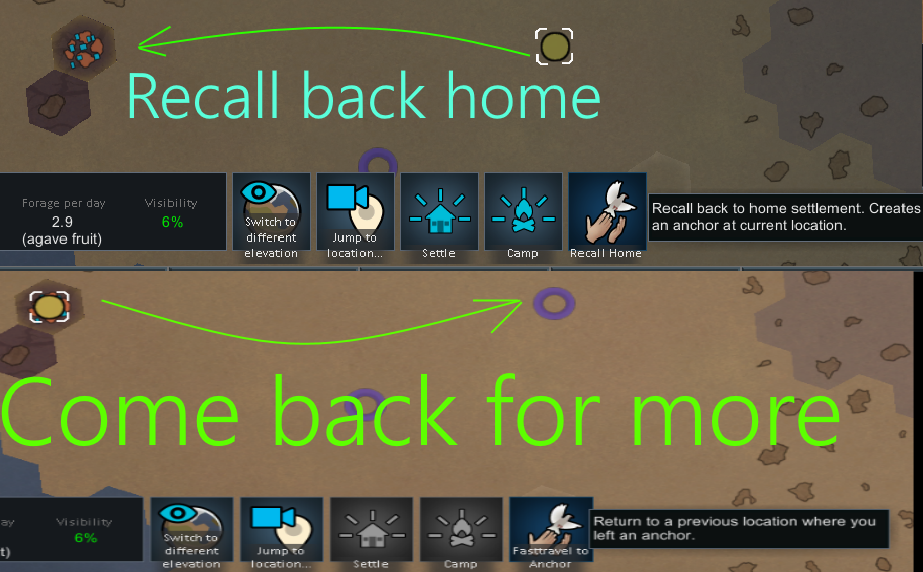
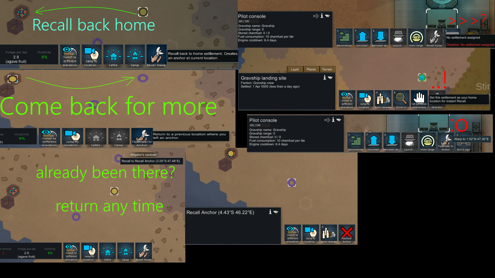

Traveling is cool but do you wish you could actually go to distant part of the world and be able to come back to your main base at any time, instantly?  
  AND then actually continue your travel (from the point where you left off) the moment you decide to leave your base? yep. there you go.  
  -supports Odyssey spaceship travel  
  -supports multiple caravans  
  
-built for rimworld 1.6  
-1.5 is not tested, but could work  
-does not require Odyssey DLC  
  

